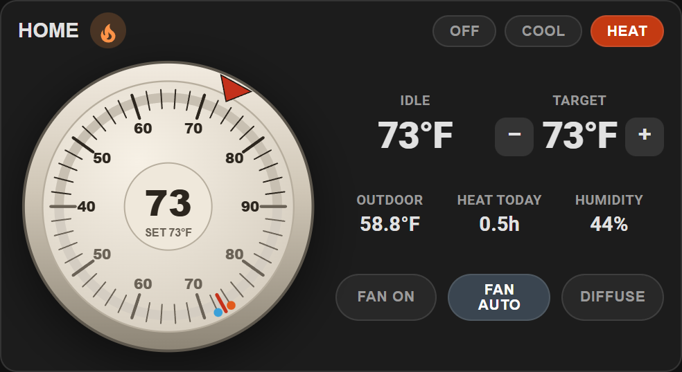
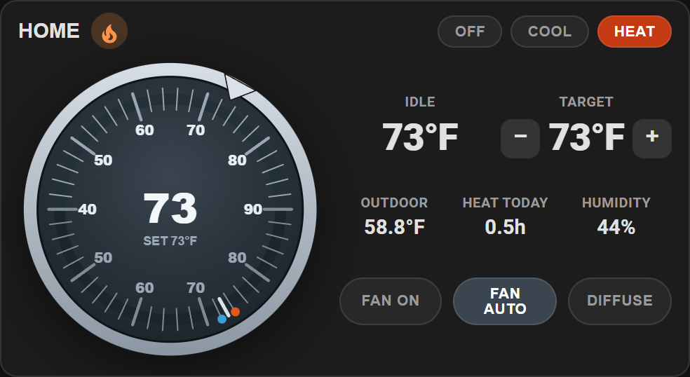
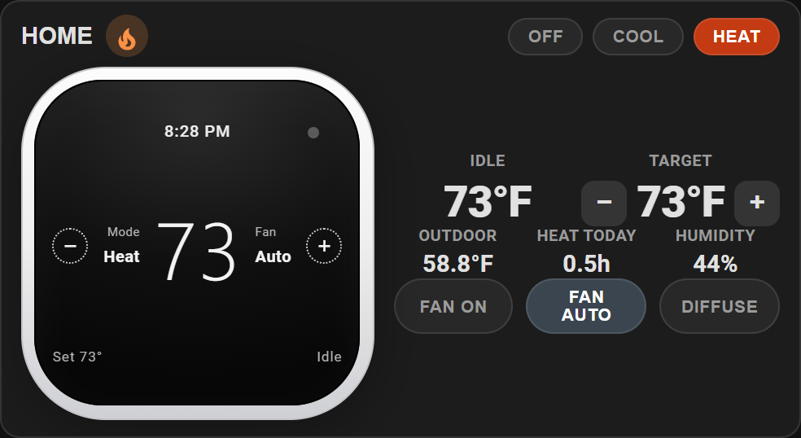
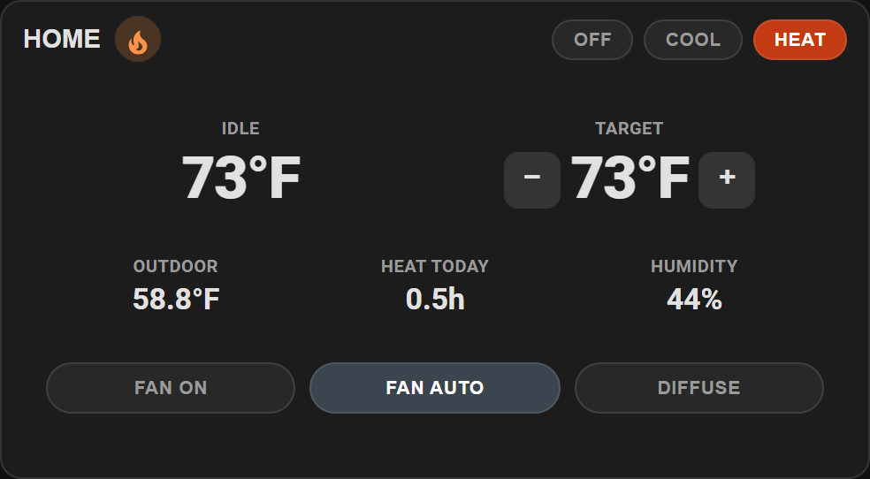

# Thermo Plus Card

[](https://github.com/hacs/integration)
[](https://my.home-assistant.io/redirect/hacs_repository/?owner=randrcomputers&repository=ha-thermo-card&category=plugin)
[](LICENSE)

Lovelace **round thermostat** for a `climate` entity. Classic Honeywell-style dial (or a modern / digital look), **− / +** setpoint, heat and cool runtime today, fan mode, and an optional daily **high–low stem** chart.

Works with any Home Assistant thermostat. History comes from the recorder (climate history or an optional indoor temperature sensor).



## Looks

Pick a style in the visual editor (**Thermostat look**) or with `look:` in YAML.

| Classic round | Modern dial | Digital face |
| :---: | :---: | :---: |
|  |  |  |
| `classic` | `modern` | `digital` |

| No dial |
| :---: |
|  |
| `show_dial: false` |

| `look` | Editor label | Notes |
| --- | --- | --- |
| `classic` | Classic round | Cream analog dial — the familiar wall thermostat (default) |
| `modern` | Modern dial | Dark circular dial with a silver bezel |
| `digital` | Digital face | Black-screen wall thermostat with on-glass − / + |

On **classic** and **modern**, the **top scale** is the target (red triangle; drag to set) and the **bottom scale** is indoor temperature (red tick). Today’s high / low are the small red / blue dots. On **digital**, tap **− / +** on the glass to change the setpoint.

Idle, Target, Outdoor, Heat today / Cool today, and Humidity are plain readouts — not buttons. Mode and fan stay as controls. Set **Show dial graphic** off, or `show_dial: false`, to hide the dial; the readouts and buttons fill the card and stay centered.

## Install

### HACS (recommended)

If HACS is already on your Home Assistant, click this button to open the repository and download it:

[](https://my.home-assistant.io/redirect/hacs_repository/?owner=randrcomputers&repository=ha-thermo-card&category=plugin)

Then **Download**, reload dashboard resources, and hard-refresh the browser (**Ctrl+F5**).

Or add it by hand: **HACS → Frontend → ⋮ → Custom repositories** →

```
https://github.com/randrcomputers/ha-thermo-card
```

Category: **Lovelace** / **Dashboard**

### Manual

1. Copy `thermo-plus-card.js` to `config/www/`
2. [](https://my.home-assistant.io/redirect/lovelace_resources/) → add `/local/thermo-plus-card.js` as a **JavaScript module**
3. Hard-refresh the browser (**Ctrl+F5**)

## Quick start

```yaml
type: custom:thermo-plus-card
name: HOME
look: classic
entity: climate.home_2
outdoor_entity: sensor.outside_temp_and_humidity_temperature
```

Mode buttons call `climate.set_hvac_mode`. Fan buttons call `climate.set_fan_mode`. The **− / +** controls on Target, or **click / drag the dial** (classic and modern looks), call `climate.set_temperature`.

Set **Card size** to **50%** in the editor, or `size: 50` in YAML, to shrink the whole card.

## What you see

| Area | Source |
| --- | --- |
| Center number / indoor scale | `current_temperature` |
| Red setpoint triangle (top scale) | Setpoint (`temperature`, or low/high in heat_cool) |
| Idle / Target | Furnace action plus room temp, and the setpoint (− / +) |
| High / low dots | Today’s min / max, midnight to midnight |
| Outdoor | Optional outdoor temperature sensor |
| Heat today / Cool today | Time `hvac_action` was heating or cooling since midnight |
| Humidity | Climate humidity, or `humidity_entity` |
| Fan | `fan_mode` on the climate entity |
| Daily range | Each day is a stem from that day’s low to high |

## Options

All of these are in the visual editor. YAML names match the editor labels below.

| YAML | Editor | Required | Default | Description |
| --- | --- | --- | --- | --- |
| `look` | Thermostat look | no | `classic` | `classic`, `modern`, or `digital` |
| `show_dial` | Show dial graphic | no | `true` | Hide the dial; text and buttons fill and center |
| `size` | Card size | no | `100` | Overall card scale: `100`, `75`, or `50` |
| `entity` | Climate / thermostat | **yes** | — | `climate` entity |
| `outdoor_entity` | Outdoor temperature | no | — | Temperature sensor shown as Outdoor |
| `temp_entity` | Indoor history sensor | no | — | Optional `temperature` sensor for daily min/max if the climate entity has no statistics |
| `name` | Card title | no | `Thermostat` | Header text |
| `unit_system` | Display units | no | `auto` | `auto`, `imperial` (°F), `metric` (°C) |
| `min_scale` | Scale low | no | entity min | Dial scale low, in the thermostat’s native units |
| `max_scale` | Scale high | no | entity max | Dial scale high |
| `humidity_entity` | Humidity sensor | no | climate humidity | Optional humidity sensor; otherwise uses the climate entity |
| `history_days` | Default history range | no | `14` | `7`, `14`, or `30` |
| `show_history` | Show daily range history | no | `false` | Daily high–low stems (makes the card taller) |
| `show_outdoor` | Show outdoor temperature | no | `true` | Hide the outdoor tile |
| `show_humidity` | Show humidity | no | `true` | Indoor humidity tile |

### Example with every option

```yaml
type: custom:thermo-plus-card
name: HOME
look: classic
size: 100
entity: climate.home_2
outdoor_entity: sensor.outside_temp_and_humidity_temperature
unit_system: imperial
history_days: 14
show_history: false
show_dial: true
show_outdoor: true
show_humidity: true
```

## Requirements

- Home Assistant **2024.1+**
- Recorder enabled (for runtime and history)
- A `climate` entity. Outdoor sensor is optional.

## License

MIT — see [LICENSE](LICENSE).
